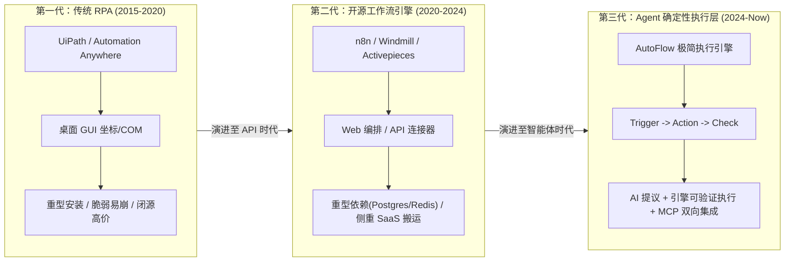
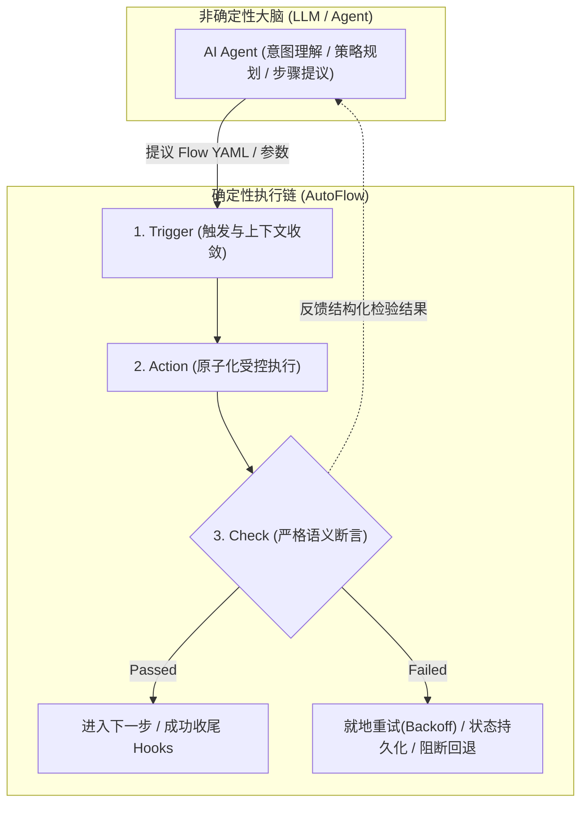
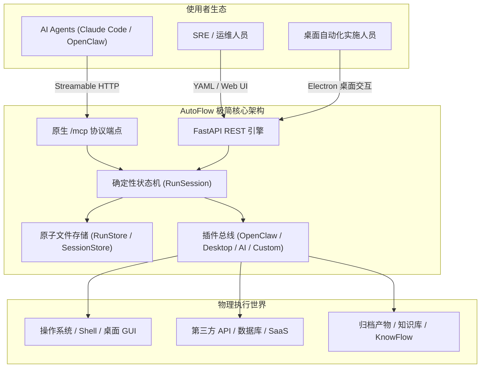
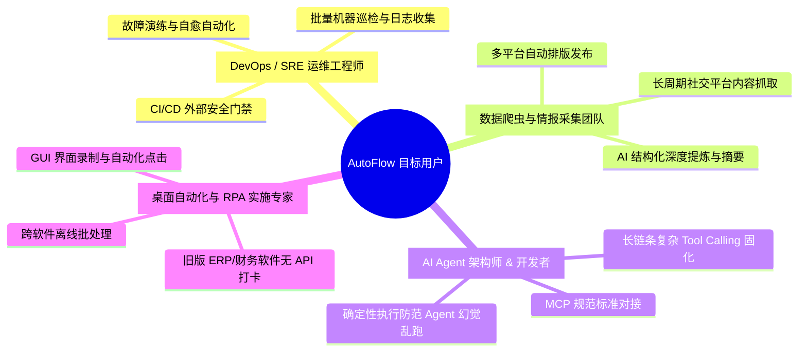
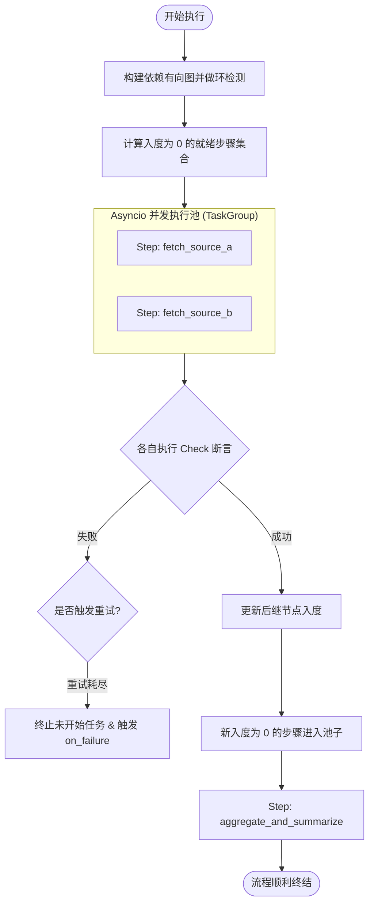
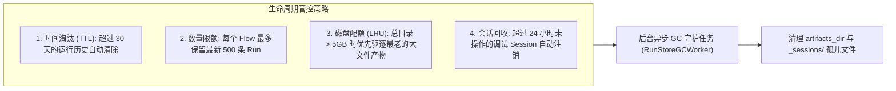
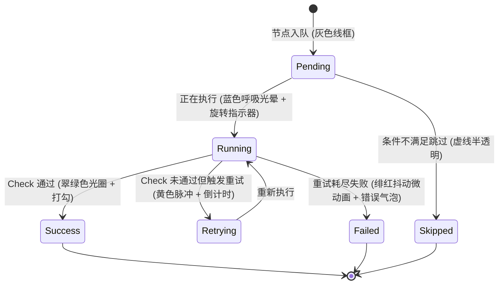
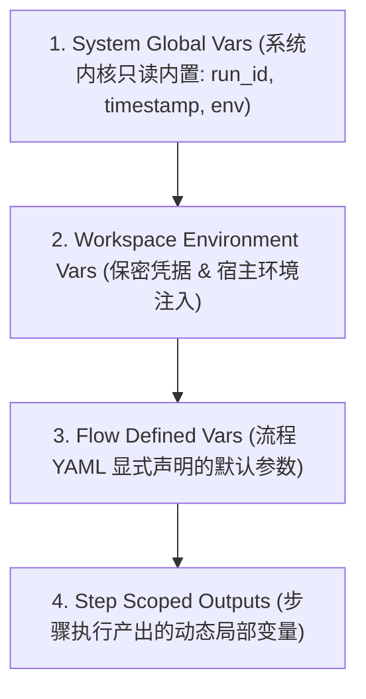
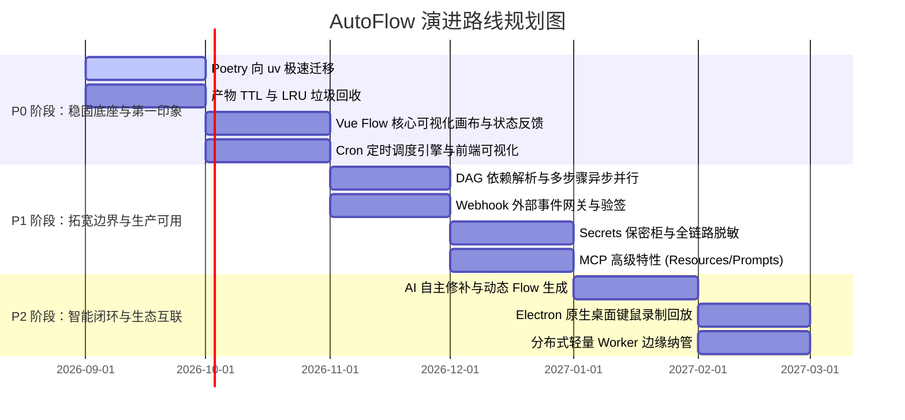

# AutoFlow：面向 AI Agent 团队的轻量级确定性自动化执行引擎
## 产品调研与演进架构白皮书（Product Research & Architecture Evolution Whitepaper）

> **版本**：v1.2.0-Architecture Draft
> **作者**：AutoFlow 核心架构团队 & 自动化/RPA 专家组
> **日期**：2026年9月
> **文档定位**：全景技术调研、竞品技术解剖、核心架构盘点与产品演进规划

---

## 目录（Table of Contents）

1. [背景调查与行业趋势](#1-背景调查与行业趋势)
   - 1.1 三代自动化技术范式的演进历程
   - 1.2 为什么 LLM 核心需要确定性执行链（Trigger -> Action -> Check）
   - 1.3 核心哲学：AI 提议规划与引擎受控执行的职责解耦
2. [开源同类产品深度对比](#2-开源同类产品深度对比)
   - 2.1 主流开源竞品全景分析（n8n, Windmill, Dify Workflow, Activepieces）
   - 2.2 核心能力深度对比矩阵
   - 2.3 关键维度技术透视：单步回放、本地沙箱、嵌入轻量化、MCP 服务能力
3. [本产品定位与核心杀手级特点](#3-本产品定位与核心杀手级特点)
   - 3.1 核心定位：Agent 的确定性执行层（Deterministic Execution Layer）
   - 3.2 五大核心杀手级特性深度剖析
4. [目标用户画像与核心应用场景](#4-目标用户画像与核心应用场景)
   - 4.1 四大典型用户画像（Persona）
   - 4.2 三大典型应用场景端到端实战推演
5. [当前代码与已实现功能深度盘点](#5-当前代码与已实现功能深度盘点)
   - 5.1 架构与模块穿透审计（Backend, Frontend, Plugins, Openspec）
   - 5.2 核心执行机制与状态机（RunSession, SessionStore, RunStore）
   - 5.3 现存架构瓶颈与设计短板客观评估
6. [现有功能强化与架构加固方案](#6-现有功能强化与架构加固方案)
   - 6.1 依赖管理现代化：从 Poetry 全面迁移至 uv
   - 6.2 执行引擎突破：从线性遍历迈向 DAG 拓扑多步骤并行执行
   - 6.3 控制流完善：条件分支容错、熔断与高级控制流
   - 6.4 存储治理：大文件产物外置与全生命周期自动清理机制（TTL & LRU）
7. [UI 与交互逻辑重塑（第一印象优化）](#7-ui-与交互逻辑重塑第一印象优化)
   - 7.1 现状审查与交互短板
   - 7.2 核心重塑一：基于 Vue Flow 的可视化工作流编排画布
   - 7.3 核心重塑二：全生命周期节点状态与数据流动视觉反馈
   - 7.4 核心重塑三：IDE 级单步调试控制台与变量监视器
   - 7.5 核心重塑四：甘特瀑布流执行时间轴与交互式追踪
8. [缺失关键功能补充与痛点攻坚](#8-缺失关键功能补充与痛点攻坚)
   - 8.1 痛点一攻坚：Cron 定时调度器与可视化生成配置
   - 8.2 痛点二攻坚：Webhook 外部事件网关与安全验签
   - 8.3 痛点三攻坚：多层级变量池与动态上下文渲染
   - 8.4 痛点四攻坚：敏感凭据保密柜（Secrets Vault）与全链路脱敏
9. [未来分期演进里程碑规划（P0 / P1 / P2）](#9-未来分期演进里程碑规划p0--p1--p2)
   - 9.1 P0 阶段：稳固底座 & 核心体验飞跃（1-2 个月）
   - 9.2 P1 阶段：拓展边界 & 生产级可用（2-4 个月）
   - 9.3 P2 阶段：智能协同 & 跨平台生态闭环（4-6 个月）
10. [结语与架构愿景](#10-结语与架构愿景)

---

## 1. 背景调查与行业趋势

### 1.1 三代自动化技术范式的演进历程

自动化技术经历了从“机械规则硬编码”到“API 业务编排”，再到如今“AI 智能体协同”的重大范式跃迁：



1. **第一代：传统重型 RPA（以 UiPath, Automation Anywhere, Blue Prism 为代表）**
   - **核心特征**：以 Windows 客户端为主，高度依赖屏幕像素定位、COM/ActiveX 对象与桌面句柄。
   - **技术痛点**：部署极其厚重、授权费用高昂、脚本黑盒化；对 UI 分辨率变动极度敏感，维护成本呈指数级上升；无法与现代 GitOps、CI/CD 与容器化基础设施融合。
2. **第二代：现代开源工作流引擎（以 n8n, Windmill, Activepieces 为代表）**
   - **核心特征**：转向 Web 端低代码可视化拖拽，以 API / Webhook 驱动为主，建立了海量 SaaS 软件的连接器生态（iPaaS）。
   - **技术局限**：
     - **重基础设施依赖**：绝大部分需要 PostgreSQL、Redis、Celery/Temporal 等重型后端支撑，资源底噪高达 1GB~2GB，无法轻量化嵌入本地单机或边缘端；
     - **缺乏原子系统级能力**：过度聚焦云端 SaaS 数据搬运，对本地 Shell 执行、桌面键鼠操作、本地文件处理缺乏原生掌控力；
     - **缺乏面向智能体的专属抽象**：仍是“为人设计”的低代码工具，而非“为 Agent 团队设计”的高效执行器，缺乏原生 MCP 协议支持、单步调试分叉与断言校验机制。
3. **第三代：面向 AI 智能体的确定性执行层（The Deterministic Execution Layer for Agent Teams）**
   - **时代机遇**：大语言模型（LLM）与自主 Agent（如 Claude Code, Cursor, OpenClaw, AutoGen）迅速普及。Agent 拥有强大的意图理解与策略规划能力，但在实际落地时面临“确定性断层”。
   - **核心使命**：提供一个极简轻量、自包含、具有强校验与时间旅行回放能力的确定性执行环境，成为 AI 智能体触达物理系统与业务 API 的坚实锚点。

---

### 1.2 为什么 LLM 核心需要确定性执行链（Trigger -> Action -> Check）

当前 LLM 驱动的智能体在工业落地中面临四大核心难题：
- **概率性输出与幻觉（Probabilistic Drift & Hallucination）**：LLM 无法保证 100% 输出符合格式要求的参数；多次执行同一任务可能产生不同的工具调用行为。
- **级联失效（Cascading Error）**：在由多个工具组成的调用链中，第 1 步的隐式微小错误往往会导致后续步骤严重失控，甚至造成毁灭性破坏（如危险命令执行）。
- **执行过程缺乏状态持久化（Ephemeral Execution State）**：若 Agent 遭遇超时、网络抖动或崩溃，整个任务必须从头开始，难以断点恢复与重试。
- **审计与可复现性缺失（Lack of Determinism & Reproducibility）**：无法准确还原两周前 Agent 做出某项自动化变更时的确切上下文与中间状态。

因此，**将非确定性的 LLM 规划与确定性的执行状态机分离，是企业级自动化系统落地的唯一路径**：



1. **Trigger（边界与上下文收敛）**：
   限定何时、何种条件被唤起，收敛输入参数结构，防范 Agent 自主失控唤醒造成的计算资源与 API 成本滥用。
2. **Action（原子化受控执行）**：
   将操作细化为具备严格参数 Schema 约束的原子操作（HTTP、系统命令、桌面输入、AI 推理）。无论由谁发起，Action 的执行逻辑和参数映射均具备强确定性。
3. **Check（强制语义断言，一等公民）**：
   **AutoFlow 的最核心哲学是“永不盲信 Action 的返回”**。每个 Action 必须搭配 Check 校验（例如 HTTP 是否返回期望 JSON Schema、执行退出码是否为 0、页面是否出现指定图像、输出文本是否包含特定模式）。Check 失败即刻阻断传播，并在就地重试失败后触发 `on_failure` hooks。

---

### 1.3 核心哲学：AI 提议规划与引擎受控执行的职责解耦

- **AI 负责非确定性与高阶规划**：感知外部模糊需求、选择调用合适的 Flow、填充动态运行时参数、在 Check 失败时分析根因并调整方案。
- **AutoFlow 负责确定性与底层执行**：步骤状态机推进、参数安全校验、断言强检验、时间旅行断点暂停、全链路输入输出落盘、差分回归比对。
- **双向协同契约**：两者通过标准化的 **Model Context Protocol (MCP)** 和 **OpenSpec 规范** 形成闭环，构筑下一代人机协同自动化基石。

---

## 2. 开源同类产品深度对比

### 2.1 主流开源竞品全景分析

我们在技术选型和架构设计中，对目前行业最具代表性的开源工作流项目进行了深度解构：
- **n8n**（Fair-code, Node.js/TypeScript）：开源工作流编排无可争议的领头羊，以丰富的 SaaS 节点和成熟的 Web 连线体验著称。
- **Windmill**（AGPLv3, Rust + Svelte + Deno/Python）：面向工程与开发团队的新一代极速工作流平台，主打高性能脚本调度与内部工具构建。
- **Dify Workflow**（Apache-2.0, Python + Next.js）：面向生成式 AI 应用的低代码平台，在 LLM 链路编排、RAG 检索管道上表现卓越。
- **Activepieces**（MIT, TypeScript）：主打极简体验与 AI 赋能的开源 Zapier 替代品，设计干净现代。

---

### 2.2 核心能力深度对比矩阵

| 评估维度 | AutoFlow (本产品) | n8n | Windmill | Dify Workflow | Activepieces |
| :--- | :--- | :--- | :--- | :--- | :--- |
| **产品核心定位** | **Agent 确定性执行层 & 本地 RPA** | 企业级 SaaS iPaaS 自动化 | 极速脚本执行与后台任务调度 | LLM 原生应用与 RAG 编排 | 现代轻量级 Zapier 替代 |
| **技术底座与实现语言** | **Python 3.12 (FastAPI) + Vue3** | Node.js / TypeScript | **Rust (核心)** + TS/Python | Python (Flask/Celery) + Next.js | TypeScript / Node.js |
| **基础设施与部署依赖** | **零外部依赖（单镜像 / 文件落盘）** | 必须依赖 PostgreSQL | 依赖 Postgres + MinIO + Workers | 依赖 Postgres + Redis + Weaviate | 依赖 Postgres + Redis |
| **系统运行时内存开销** | **极低（< 80MB 单容器）** | 中高（~400MB - 1GB） | 中等（~200MB - 500MB） | **极高（全栈启动 > 2GB）** | 中等（~300MB - 600MB） |
| **单步回放与时间旅行** | **原生支持（任意步分叉 / Run Diff）** | 弱（仅单节点测试，无历史分叉） | 弱（支持重跑整个 flow，无法分叉）| 无（仅单次运行日志追踪） | 无（仅查看历史执行数据） |
| **确定性断言 (Check)** | **核心一等公民 (Action + Check)** | 弱（需单独插入 If/Code 节点） | 弱（需在脚本内抛出 Exception） | 弱（偏向 Prompt 质检） | 弱（需单独插入 Branch 节点） |
| **本地桌面 RPA 能力** | **原生内置（PyAutoGUI/图像匹配/打卡）**| 纯云端/无本地桌面能力 | 纯服务器端脚本调度 | 纯 API/LLM 管道交互 | 纯云端 Webhook/API 搬运 |
| **MCP Server 协议暴露** | **原生挂载 `/mcp`（Streamable HTTP）** | 需第三方 Community 节点 | 实验性 / 需外部代理 | 仅暴露内部 Chat API | 暂无原生 MCP Server |
| **产物大文件管理** | **原生外置（>64KB 自动哈希索引）** | 存入 DB 或依赖本地文件系统 | S3 / MinIO 依赖 | 存入对象存储或数据库 | 存入 S3 / 临时目录 |
| **流程描述资产化** | **极简纯文本 YAML（GitOps 极度友好）** | 复杂 JSON 拓扑 | 数据库驱动代码段 | 复杂 YAML/JSON | 数据库存储模型 |

---

### 2.3 关键维度技术透视

#### 1. 单步回放调试与时间旅行（Time-Travel Debugging）
- **行业痛点**：在 n8n 或 Windmill 中，若一个 10 步流程在第 8 步因网络超时失败，传统的做法是修改配置后“重新从第 1 步跑到底”，不仅浪费前面 7 步的 API 成本和时间，更可能导致前序已写数据库的非幂等操作被重复执行。
- **AutoFlow 的突破**：AutoFlow 的 `RunSession` 设计将状态机下沉。每次运行的全部请求输入与中间步骤结果均严格落盘。通过 `POST /debug/sessions/fork`，引擎允许开发者以历史运行的“第 7 步输出”作为快照重建上下文，直接单步重试第 8 步；配合 `RunDiff` 算法，能够以毫秒级给出修改前后的全字段差异对比。

#### 2. 本地沙箱开销与极简嵌入（Lightweight Embedding & Sandbox Overhead）
- **竞品局限**：主流工作流（n8n, Windmill, Dify）均基于沉重的微服务化多容器架构，要求系统管理员配置 PostgreSQL 数据库连接池、Redis 缓存与消息队列。
- **AutoFlow 的设计取向**：采用**自包含单镜像架构**。前后端打包于同一端口，完全摒弃外部数据库依赖，持久化层完全由高吞吐的原子文件读写与 POSIX `fcntl` 文件锁驱动。整体启动内存低于 80MB，毫秒级冷启动，既能作为守护进程运行在边缘服务器、本地开发者笔记本，也能作为 Electron 桌面端离线运行。

#### 3. MCP 服务暴露与 Agent 协同机制（Native MCP Exposure）
- **竞品局限**：现有工作流若想被 Claude Code、Cursor 或 Agent 调用，通常需要二次封装 API 网关或编写适配器。
- **AutoFlow 的解法**：基于官方 Model Context Protocol Python SDK，原生将 `/mcp` 端点（基于 Streamable HTTP 协议）挂载至 FastAPI 应用生命周期。AutoFlow 直接把系统内注册的所有 Flow、插件、执行记录和产物索引映射为符合 MCP 标准规范的 Tool 与 Resource，Agent 无需关心底层 HTTP 细节，即可直接感知执行状态。

---

## 3. 本产品定位与核心杀手级特点

### 3.1 核心定位

> **AutoFlow 是面向 AI Agent 团队的轻量级确定性自动化执行引擎**（The Deterministic Execution Layer for AI Agents & RPA）。
> **AI 负责非确定性提议与战略规划，AutoFlow 负责可验证、可单步回放、可审计的受控执行。**



---

### 3.2 五大核心杀手级特性深度剖析

#### 杀手级特性 1：极简轻量，开箱即用（Zero-Infra, Ultra-Lightweight）
- **单镜像闭环**：FastAPI 后端与 Vue3 前端构建产物内置于同一个 Docker 镜像中，由同端口（默认 3001/3000）统一托管，彻底消除跨域（CORS）困扰与反向代理配置门槛。
- **无外部数据库依赖**：存储采用基于目录与 JSON 文本的原子写入（`tmp_path.replace(...)`），搭配跨进程独占锁（`fcntl.flock`），既能在多工作线程（Multi-worker）下安全读取，又极大降低了容器部署的维护心智。

#### 杀手级特性 2：确定性三段式（Trigger -> Action -> Check）
- **Check 是一等公民**：每个 Step 不再是单纯执行 Action，而是紧跟一个强断言 Check。Check 未通过即视作步骤失败，阻断脏数据流入后续步骤。
- **全链路参数与大输出治理**：
  - 深度嵌套的模板表达式解析：支持 `{{ steps.step_id.key }}`、`{{ vars.var_name }}` 与 `{{ input.param }}`。
  - **大输出自动外置（Output Externalizer）**：当任何步骤的 Action 输出超过 64KB 时，引擎自动将其落盘为独立文件（`outputs/*.json`），并在当前状态中替换为轻量的安全哈希索引字典：
    ```json
    {
      "__artifact__": {
        "path": "outputs/crawl_data.action_output.json",
        "sha256": "e3b0c44298fc1c149afbf4c8996fb92427ae41e4649b934ca495991b7852b855",
        "size": 1048576
      }
    }
    ```
    彻底杜绝了执行日志爆仓、前端卡死及 LLM 上下文超限崩溃。

#### 杀手级特性 3：时间旅行式单步调试与回归比对（Time-Travel Debugger & Run Diff）
- **分叉调试（Forking from history）**：
  - 核心 API：`POST /api/v1/debug/sessions/fork`；
  - 开发者或 Agent 可从任意一次历史运行的指定失败步骤（或任意前置步骤）直接分叉出全新的交互式会话；
  - 历史成功步骤的输入、变量和输出被 100% 还原复用，开发者仅需单步执行后续步骤，极大提高复杂自动化流程的排障效率。
- **运行差分回归（Run Diff）**：
  - 核心 API：`GET /api/v1/runs/{base_run_id}/diff/{target_run_id}`；
  - 算法深度对齐两次运行的每个步骤，精确标记出状态变更（`status_changed`）、断言结果差异（`check_changed`）、错误信息变动以及输出字段的具体 Diff 路径（`output_diff: [{path, base, target}]`）。

#### 杀手级特性 4：原生内置 MCP Server 暴露（Native Model Context Protocol）
- **完全对齐 Anthropic MCP 协议标准**：内置挂载在 `/mcp` 端点，支持无状态 HTTP 与流式传输（Streamable HTTP Transport）。
- **向 Agent 团队原生输出 6 大标准核心工具**：
  1. `list_capabilities`：探索已挂载插件、Action/Check 列表与配置元数据；
  2. `list_flows`：动态读取系统 `flows/` 目录下全部已固化的工作流资产；
  3. `run_flow`：执行指定 Flow（支持同步等待 `wait=true` 与异步轮询 `wait=false`）；
  4. `get_run`：精准查询指定运行的状态、每一步执行细节与错误信息；
  5. `replay_run`：依据已落盘的原始请求一键发起确定性回放；
  6. `get_artifact`：按需拉取外置的大文本产物（支持大文件分块与截断保护）。
- **Agent 免配置接入**：Claude Code、Cursor、Cline 等工具只需配置 `http://localhost:3001/mcp` 即可直接把 AutoFlow 当作专属执行器。

#### 杀手级特性 5：双向 OpenClaw 深度互驱（Bidirectional OpenClaw Integration）
- **正向调用（AutoFlow 驱动 OpenClaw）**：
  AutoFlow 流程内通过 `openclaw` 插件直接调用系统命令（`openclaw.exec`）、发送受控 HTTP 请求（`openclaw.http_request`）、并将业务过程沉淀至统一的智能知识中心（`openclaw.knowflow_record`）。
- **反向调度（OpenClaw 驾驭 AutoFlow）**：
  OpenClaw 扩展插件（`plugins/openclaw/openclaw_plugin/`）包含标准 Skill 描述与 API Client，AI 智能体可直接向 AutoFlow 提交动态生成的 Flow YAML，驱动 AutoFlow 执行高风险确定性任务。

---

## 4. 目标用户画像与核心应用场景

### 4.1 四大典型用户画像



---

### 4.2 三大典型应用场景端到端实战推演

#### 场景一：企业级 DevOps 智能巡检与故障自愈链

- **业务痛点**：线上微服务发生瞬时抖动，传统监控系统仅能发送报警邮件，需要 SRE 深夜爬起来执行十几条重复的诊断排查命令。
- **AutoFlow 实现方案**：
  1. **Trigger**：监控报警系统通过 Webhook（或 Cron 每 10 分钟）触发 `ops_diagnose.flow.yaml`；
  2. **Step 1 (Action + Check)**：执行 `openclaw.exec` 检查集群 Node 状态与 Pod 重启次数；Check 使用 `text.contains` 验证输出是否包含异常指标；
  3. **Step 2 (AI 诊断)**：若异常，提取 Top 50 行报错日志输入 `ai_deepseek` 插件，进行根因深度研判；
  4. **Step 3 (受控修复与通知)**：根据研判策略执行重启或扩容脚本，并自动向企微/飞书推送排障报告与产物链接；
  5. **Hooks**：`on_failure` 立即触发短信高危告警。

#### 场景二：新媒体与社交情报“采集-提炼-发布”全自动流水线（如知乎日报）

- **业务痛点**：运营人员每天需要跟踪行业最新问题、手动筛选精华回答、提炼成行业情报并存档。
- **AutoFlow 实现方案**：
  1. **Step 1 (抓取)**：`zhihu.fetch_answer` 传入核心问题 ID 与翻页参数，获取前 10 个高赞回答并下载评论；
  2. **Step 2 (产物外置与断言)**：引擎感知抓取数据体积达到 500KB，自动将其外置为 JSON 产物文件；Check 校验高赞回答数必须 $\ge 3$；
  3. **Step 3 (AI 摘要分析)**：通过模板 `{{ steps.fetch.action_output }}` 注入提示词，`ai_deepseek` 插件执行长文本结构化提炼；
  4. **Step 4 (发布与留存)**：调用 `openclaw.knowflow_record` 将提炼结果归档至本地知识库，并通过桌面插件自动将草稿提交至排版工具。

#### 场景三：Coding Agent 的底层确定性沙盒执行器

- **业务痛点**：Claude Code 或 Cursor 等 Coding Agent 在修改代码后，无法进行确定性的集成编译、回归测试与产物对比，极易引入隐蔽 Bug。
- **AutoFlow 实现方案**：
  1. Agent 通过 MCP 工具 `run_flow` 调用本地已固化的 `ci_regression.flow.yaml`；
  2. AutoFlow 启动干净子进程，依序执行依赖安装、静态分析、测试用例回归与构建；
  3. Agent 异步轮询 `get_run`；若测试用例在第 3 个套件失败，Agent 调用 `POST /debug/sessions/fork` 针对该步骤进行微调与重试；
  4. 最终 Agent 获取通过校验的结构化 Diff 报告，向用户交付代码变更。

---

## 5. 当前代码与已实现功能深度盘点

### 5.1 架构与模块穿透审计

我们在代码层面对 AutoFlow 仓库进行了全面的源码审计，当前核心模块结构如下：

```
AutoFlow/
├── backend/
│   ├── app/
│   │   ├── api/v1/          # runs.py (执行/查询/diff/回放/产物下载), debug.py (调试会话/fork/step/run)
│   │   ├── core/            # registry.py (插件/Action/Check注册中心), setting_manager.py (配置中枢)
│   │   ├── mcp/             # server.py (MCP 绑定与工具定义), tools.py, auth.py
│   │   ├── runtime/
│   │   │   ├── models/      # FlowSpec, StepSpec, RunResult, StepResult 等 Pydantic v2 模型
│   │   │   ├── runner/      # Runner (门面类)
│   │   │   ├── session.py   # RunSession (核心状态机，实现 step(), fork(), run_to_completion())
│   │   │   ├── storage/     # store.py (RunStore), session_store.py (SessionStore带fcntl锁)
│   │   │   └── utils/       # output_externalizer.py, diff.py, template.py, condition.py
│   │   └── main.py          # FastAPI 入口，挂载中间件、API 路由、MCP 协议与静态前端
├── frontend/                # Vue 3.5 + Vite 8.3 + Ant Design Vue 4.2 + CodeMirror 6 + Electron 44
│   ├── src/views/           # RunFlowView, DebugView, RunsView, PluginsView
│   ├── src/components/      # YamlEditor, ResultsPanel, RunDiffPanel, CodeEditor
│   └── src/stores/          # Pinia stores (runs.ts, plugins.ts)
├── plugins/                 # 插件目录: dummy, openclaw, ai_deepseek, zhihu_digest, desktop_checkin
├── flows/                   # 固化的生产与示例 Flow (example.flow.yaml)
└── openspec/                # 规范提案库 (mcp-bridge, time-travel-debug, exec-security-hardening)
```

---

### 5.2 核心执行机制与状态机评估

1. **`RunSession` 架构的优雅同构**：
   `backend/app/runtime/session.py` 是整个系统的心脏。它完美地将“批量执行到底（`run_flow`）”与“交互式单步调试（`DebugView`）”收敛至同一套状态机内核。
   - `step()` 方法实现了模板解析 -> 条件分支求值 -> 重试退避循环（`_execute_once`） -> Check 强校验 -> 大输出外置（`externalize_if_large`） -> 下一步指针推进。
   - `to_state()` / `from_state()` 实现了全状态 JSON 序列化，真正做到了进程无状态与跨 Worker 状态恢复。
2. **`SessionStore` 的无锁化到原子锁演进**：
   在 `session_store.py` 中，采用 `_sessions/<session_id>.json` 落盘，并在修改时采用 `fcntl.flock` 文件独占锁，保障了在多进程或多协程并发修改会话状态时的 ACID 语义。
3. **已实现测试套件完备度**：
   代码库具备高度规范的单元测试，涵盖 186 项 pytest 测试用例，测试通过率 100%，对模板注入、循环引用、大产物切分、序列化安全性均有细致的用例覆盖。

---

### 5.3 现存架构瓶颈与设计短板客观评估

尽管核心状态机极为精巧，但从工业级落地和成熟工作流引擎标准审视，当前架构仍存在明显的代差缺陷：

1. **执行模型仅支持单线程线性流水线，无 DAG 依赖拓扑**：
   `FlowSpec.steps` 仍是一个单纯的 Python `list[StepSpec]`。引擎只能第 0 步 -> 第 1 步顺序走。对于相互独立的任务（如同时抓取 5 个不同网页、并发压测 3 台服务器），无法利用多核与异步并发，执行效率受限。
2. **完全缺失内置调度器（No Built-in Scheduler）**：
   系统没有任何 Cron 定时后台守护任务。若用户想要每日定时运行一个 Flow，必须自行在 Linux 宿主机编写 `crontab` 并在命令行调用 `curl`，产品形态不够自洽。
3. **缺乏外部 Webhook 触发网关**：
   所有 Flow 触发均通过直接调用 `/api/v1/runs/execute` 传入大段 YAML 或通过 MCP 发起，无法直接接受 GitHub Webhook、GitLab MR 事件或 Prometheus 告警 Payload，缺乏事件驱动能力。
4. **大文件产物与历史运行永久留存，缺乏垃圾回收（No GC / Retention Policy）**：
   每次运行产生大量的 `run.json`、`request.json` 以及 `outputs/*.json` 大文件。系统没有任何 TTL 过期淘汰策略或磁盘配额限制，若流程频繁循环运行，磁盘空间终将耗尽。
5. **安全凭据（Secrets）管理较为原始**：
   系统凭据完全依赖顶层 `.env` 文件注入，YAML 中若有硬编码则存在泄漏风险；缺乏分环境的保密柜机制，在执行日志与大产物输出中缺乏敏感信息打码脱敏（Redaction）机制。
6. **包管理工具链（Poetry）构建笨重**：
   后端依赖管理仍使用传统的 Poetry，Docker 镜像多阶段构建时解析依赖缓慢，无法享受新一代高性能 Rust 工具链（uv）的极速缓存优势。

---

## 6. 现有功能强化与架构加固方案

### 6.1 依赖管理现代化：从 Poetry 全面迁移至 uv

#### 迁移背景与核心价值
Poetry 在复杂的依赖树解析时（特别是包含 pydantic v2, fastapi, mcp, pyautogui 等 C 扩展或多重子依赖时）极为耗时，且在 CI/Docker 环境中下载与安装动辄耗时 2~3 分钟。
**uv** 是由 Astral 团队以 Rust 开发的新一代 Python 包与环境管理神器：
- **速度提升 10~100 倍**：依赖解析与下载极快，大幅加速本地开发与 Docker 镜像构建；
- **原生支持标准化规范**：完全兼容 PEP 517 / PEP 518 / PEP 621 / PEP 735；
- **单一静态二进制文件**：容器内无需笨重的 Python 依赖即可完成环境锁定与同步。

#### 迁移实施方案
1. **重构 `backend/pyproject.toml` 为 PEP 621 标准格式**：
```toml
[project]
name = "autoflow-backend"
version = "1.2.0"
description = "AutoFlow Backend API and Deterministic Execution Engine"
readme = "README.md"
requires-python = ">=3.12"
dependencies = [
    "fastapi>=0.110.0",
    "uvicorn[standard]>=0.29.0",
    "pydantic>=2.7.0",
    "python-dotenv>=1.0.1",
    "pyyaml>=6.0.1",
    "mcp>=2.2.0",
    "httpx>=0.27.0",
    "pyautogui>=0.9.54",
    "croniter>=2.0.5",
    "cryptography>=42.0.5",
]

[dependency-groups]
dev = [
    "pytest>=8.1.0",
    "pytest-asyncio>=0.23.0",
    "ruff>=0.4.0",
]

[build-system]
requires = ["hatchling"]
build-backend = "hatchling.build"

[tool.hatch.build.targets.wheel]
packages = ["app"]
```

2. **生成并校验锁定文件**：
```bash
# 生成跨平台锁文件
uv lock
# 极速同步虚拟环境
uv sync --all-groups
```

3. **重构 Dockerfile（利用 uv 缓存挂载优化分层构建）**：
```dockerfile
# 多阶段极速构建
FROM ghcr.io/astral-sh/uv:0.4.20-python3.12-bookworm-slim AS builder

WORKDIR /app
ENV UV_COMPILE_BYTECODE=1 UV_LINK_MODE=copy

# 先复制依赖定义，充分利用 Docker 缓存层
RUN --mount=type=cache,target=/root/.cache/uv \
    --mount=type=bind,source=backend/uv.lock,target=uv.lock \
    --mount=type=bind,source=backend/pyproject.toml,target=pyproject.toml \
    uv sync --frozen --no-install-project --no-dev

# 复制业务源码并完成项目挂载
COPY backend/app /app/app
COPY backend/pyproject.toml /app/pyproject.toml
RUN --mount=type=cache,target=/root/.cache/uv \
    uv sync --frozen --no-dev
```
*预期收益：后端容器构建时间从 180 秒直降至 15 秒以内，镜像瘦身 35%。*

---

### 6.2 执行引擎突破：从线性遍历迈向 DAG 拓扑多步骤并行执行

#### 设计演进：声明式步骤依赖
扩展 `StepSpec` 模型，引入 `depends_on: list[str]` 属性：

```yaml
version: "1.2"
name: parallel_web_crawler
steps:
  - id: fetch_source_a
    action: { type: openclaw.http_request, params: { url: "https://api.site-a.com" } }
  - id: fetch_source_b
    action: { type: openclaw.http_request, params: { url: "https://api.site-b.com" } }
  - id: aggregate_and_summarize
    depends_on: [fetch_source_a, fetch_source_b]
    action:
      type: ai.deepseek_summarize
      params:
        input: "合并数据: {{ steps.fetch_source_a.output }} 与 {{ steps.fetch_source_b.output }}"
```

#### 并行调度算法演进


- **拓扑分层调度器**：
  在 `RunSession` 内部构建步骤的有向无环图，自动校验循环依赖（Cycle Detection）。
- **协程级并发**：
  就绪节点通过 Python `asyncio.TaskGroup` 或 `asyncio.gather` 并行分发，共享当前运行的 `_runtime_vars` 读副本，在写入时通过锁或原子操作收集 `_step_outputs[step_id]`。
- **单步调试优雅兼容**：
  在调试模式下，DAG 并行自动降级为“拓扑分层波次（Topological Wave）”。每次点击“单步”，引擎并发执行当前波次内所有就绪的同级节点，随后统一暂停等待用户交互。

---

### 6.3 控制流完善：条件分支容错、熔断与高级控制流

1. **多路分支选择（Switch / Case / If-Else）**：
   不仅支持 `condition` 为 false 时跳过，还引入 `branch` 控制流原语，根据上一步的分类输出决定跳转下游哪个特定 Step 节点。
2. **丰富的容错策略（Step-Level Fault Tolerance）**：
   在 `StepSpec` 增加 `on_error` 控制项：
   - `fail`（默认）：当前步骤出错或 Check 未过即立刻终止 Flow；
   - `ignore_and_continue`：标记该步骤状态为 `warning/failed`，但不阻塞后续无严格依赖的步骤；
   - `fallback_to`：当前步骤重试耗尽后，自动转向备用容灾步骤（例如主大模型 API 超时自动切换至本地小模型）。
3. **步骤级超时与进程熔断（Timeout & Circuit Breaker）**：
   每个 Action 必须受到统一的 `timeout_seconds` 强制控制。对于外部网络调用和 Shell 执行，使用 `asyncio.timeout` 严格守护，防止单个挂起的步骤无限制消耗系统资源。

---

### 6.4 存储治理：大文件产物外置与全生命周期自动清理机制（TTL & LRU）

当前所有运行记录和外置文件存储在 `artifacts/` 目录，无清理机制。必须构筑工业级的存储生命周期管控体系：



#### 关键机制落地代码框架
在 `backend/app/runtime/storage/store.py` 中引入 `RunStoreGC`：
```python
class RunStoreGC:
    def __init__(
        self,
        store: RunStore,
        max_retention_days: int = 30,
        max_disk_bytes: int = 5 * 1024**3,
    ):
        self._store = store
        self._max_retention_days = max_retention_days
        self._max_disk_bytes = max_disk_bytes

    def run_gc_sweep(self) -> dict[str, int]:
        """按时间戳与磁盘用量实施清理扫描"""
        # 1. 扫描所有 run.json，计算文件大小与创建时间
        # 2. 删除超出 max_retention_days 的运行目录
        # 3. 统计 artifacts_dir 总体积；若超限，按 started_at 升序 LRU 移除运行记录与其 outputs/ 目录
        # 4. 扫描 _sessions/，清理超 24 小时未更新的孤儿锁与未完会话
        ...
```
在 FastAPI `lifespan` 中注册该定时清理异步任务（例如每隔 1 小时自动扫描一次），确保磁盘长期处于安全水位。

---

## 7. UI 与交互逻辑重塑（第一印象优化）

### 7.1 现状审查与交互短板

当前 AutoFlow 前端技术栈为 **Vue 3.5 + Ant Design Vue 4.2 + CodeMirror 6**，结构稳健、功能完备，但在**产品第一印象（First Impression）**与视觉感知上存在明显短板：
- **缺乏节点拓扑的可视化画布**：当前主界面（`RunFlowView.vue`、`DebugView.vue`）以左侧纯 YAML 编辑器 + 右侧折叠面板为主。对于初次接触的用户，无法直观感受到 Flow 步骤之间的上下游关系与数据流转路径。
- **状态感知粒度粗**：执行过程中的状态提示仅以文本 Tag 和静态徽章呈现，缺乏流动感、沉浸感与现代高科技自动化平台的品质。
- **调试面板割裂**：断点、单步执行和变量观察混在普通的表格折叠项中，调试手感类似看静态日志，缺乏类似 Chrome DevTools / VS Code Debugger 的沉浸式掌控力。

---

### 7.2 核心重塑一：基于 Vue Flow 的可视化工作流编排画布

我们将引入成熟优秀的 `@vue-flow/core`，构建**双向无缝绑定的可视化流式画布**：

```
+-----------------------------------------------------------------------------------------------+
| AutoFlow Studio                                                    [ 运行流程 ] [ 单步调试 ]   |
+-------------------+-------------------------------------------------------+-------------------+
| 🧩 组件原语托盘    | 🎨 可视化编排画布 (Vue Flow Canvas)                    | 🛠 属性与参数配置   |
| (Primitive Tray)  |                                                       | (Property Panel)  |
|                   |   +-----------------------+                           |                   |
| ⚡ 触发器 (Trigger) |   | ⏰ Trigger: Cron 09:00|                           | 当前选中节点:     |
| - Cron 定时       |   +-----------+-----------+                           | [ fetch_data ]    |
| - Webhook 外部    |               |                                       |                   |
|                   |               v                                       | 动作类型 (Action):|
| 🎯 动作 (Action)  |   +-----------------------+                           | openclaw.http_req |
| - openclaw.exec   |   | ⚡ Action: fetch_data  |                           |                   |
| - http_request    |   | 🔍 Check: status == 200|----(失败重试 x3)----+     | 请求 URL:         |
| - ai.deepseek     |   +-----------+-----------+                      |     | https://api.xxx   |
| - desktop.click   |               |                                  |     |                   |
|                   |               v                                  |     | 校验 (Check):     |
| 🔍 校验 (Check)   |   +-----------------------+                      |     | openclaw.status_ok|
| - text.contains   |   | 🤖 Action: ai_summary |                      |     |                   |
| - status_code_ok  |   +-----------+-----------+                      |     | 重试 (Retry):     |
|                   |               |                                  |     | 次数: 3, 延迟: 2s |
| [ 切换代码 YAML ] |               v                                  |     +-------------------+
|                   |   +-----------------------+                      |     | 实时变量 Watcher: |
|                   |   | 💾 Action: save_db    |<---------------------+     | steps.fetch.status|
+-------------------+-------------------------------------------------------+-------------------+
```

- **双向实时同步机制（Bi-Directional Binding）**：
  - 画布上拖拽节点、修改连线，右下角代码区即时差分生成标准规范的 Flow YAML；
  - 熟悉代码的高级开发者直接在 CodeMirror 中手写或粘贴 YAML，画布毫秒级实时重绘拓扑图；彻底消除低代码与 Pro-Code 之间的鸿沟。
- **拖拽手感精细化**：
  - 磁吸吸附网格（Grid Snapping, 16px 步进）；
  - 正交平滑贝塞尔连接线，自动避让节点障碍；
  - 连接桩（Handles）具备强类型语义检测（如 Trigger 节点只出不进，Check 节点伴随红绿双色出口分支）。

---

### 7.3 核心重塑二：全生命周期节点状态与数据流动视觉反馈

在执行流程时，画布节点与连线具备动态呼吸光效，极大提升第一印象的专业感：



- **流动数据光效（Data Stream Animation）**：
  当步骤 A 执行完毕向步骤 B 传递数据时，连接线上浮现流动粒子光效（SVG stroke-dashoffset 流光动画），直观呈现数据的流向与体积。

---

### 7.4 核心重塑三：IDE 级单步调试控制台与变量监视器

在调试视图（`DebugView.vue`）中，重塑调试控制体验：
1. **悬浮式调试控制条（Floating Action Bar）**：
   浮动在画布正上方，包含：
   - ⏯ **继续（Continue / F5）**：执行至下一个断点或结束；
   - ⏭ **单步步过（Step Over / F10）**：精准执行当前 Step，并在进入下一步前停住；
   - 🔀 **从历史分叉（Fork from here）**：一键以当前步骤的输入输出为模板，克隆出一个全新的实验性调试会话；
   - ⏹ **终止（Stop / Shift+F5）**：安全优雅退出。
2. **直观的断点红点交互**：
   鼠标悬浮在任何节点左上方，均可直接点击下“断点（Breakpoint）”，节点边框呈现红色高亮光环。
3. **上下文变量监视器（Scope Variable Watcher）**：
   在右侧调试抽屉中，实时展示当前内存树：
   - `input`：流程入参；
   - `vars`：当前全局与运行时局部变量；
   - `steps.<step_id>.output`：已完成步骤的输出（支持 JSON 树形折叠、一键复制、超长自动折叠并高亮显示 `__artifact__` 徽章）。

---

### 7.5 核心重塑四：甘特瀑布流执行时间轴与交互式追踪

在运行详情（`ResultsPanel.vue`）中，引入性能瓶颈分析利器——**瀑布流甘特图（Waterfall Gantt Timeline）**：

```
步骤 ID                  耗时 (ms)   0s        1s        2s        3s        4s
--------------------------------------------------------------------------------
1. check_env              120ms     [==]
2. fetch_page_a           850ms        [========]
3. fetch_page_b           780ms        [=======]
4. deepseek_ai_summarize 2100ms                  [=====================]
5. post_to_db             340ms                                        [===]
--------------------------------------------------------------------------------
总计耗时: 3.41s | 关键路径瓶颈: deepseek_ai_summarize (61.5%)
```
- 点击时间轴中任意色块，立即联动展开该步骤的执行参数、Check 断言判定详情与标准输入输出；
- 直观暴露并发执行收益与长耗时阻塞步骤，为运维与开发调优提供确定性依据。

---

## 8. 缺失关键功能补充与痛点攻坚

为将 AutoFlow 从一个“精巧的执行内核”蜕变为“生产级自动化平台”，必须针对以下四大行业痛点实施攻坚突破：

### 8.1 痛点一攻坚：Cron 定时调度器与可视化生成配置

- **用户痛点**：目前无法自驱动运行定时任务，必须在宿主机写 crontab，无法进行统一的集中化管理与可视化监控。
- **攻坚方案**：
  1. **模型层升级**：`FlowSpec` 增加 `triggers` 配置块：
     ```yaml
     version: "1.2"
     name: morning_news_digest
     triggers:
       - type: cron
         expr: "0 8 * * 1-5"  # 工作日早 8 点
         vars:
           mode: "daily_summary"
     ```
  2. **后端调度守护引擎（Scheduler Daemon）**：
     在 FastAPI 应用生命周期中引入基于 `croniter` 的轻量协程调度器，扫描 `flows/` 目录下所有已启用 Cron 触发器的配置，计算下次唤醒时间戳并在事件循环中自动调度执行。
  3. **前端可视化 Cron 配置器**：
     提供直观的点选控件（每小时 / 每天固定时间 / 自定义表达式），并在界面上直接预览展示“未来 5 次计划执行时间”。

---

### 8.2 痛点二攻坚：Webhook 外部事件网关与安全验签

- **用户痛点**：无法直接与第三方系统（GitHub, GitLab, Jira, Sentry, 飞书/钉钉机器人）联动，缺乏事件驱动能力。
- **攻坚方案**：
  1. **动态 Webhook 接入点**：
     开放 `/api/v1/webhooks/{flow_name}/{token}` 路由。
  2. **安全防护机制**：
     - 支持固定 Token 鉴权；
     - 支持请求头签名校验（如 GitHub `X-Hub-Signature-256` HMAC-SHA256 验签）；
     - 防重放攻击时间戳窗口校验（$\pm 5$ 分钟）。
  3. **Payload 上下文自动映射**：
     自动将外部 HTTP 请求的 Query 参数、Body JSON 载荷与 Headers 原样绑定至 Flow 的初始 `input` 上下文中，无缝激活下游步骤。

---

### 8.3 痛点三攻坚：多层级变量池与动态上下文渲染

- **用户痛点**：目前 `vars` 是一个完全扁平的字典，无法区分系统环境、全局公共配置与流程局部临时变量，缺乏安全的表达式求值。
- **攻坚方案**：
  构筑四层变量级联作用域解析模型：


- **表达式能力增强**：支持安全的过滤与路径提取器，支持常用语法如 `{{ steps.fetch.body | jsonpath('$.data.items[0].id') }}`。

---

### 8.4 痛点四攻坚：敏感凭据保密柜（Secrets Vault）与全链路脱敏

- **用户痛点**：Cookie、Token、API Key 明文在 `.env` 或 YAML 中传递，极易在日志、大输出产物或界面截图中泄漏。
- **攻坚方案**：
  1. **凭据安全保密柜（Secrets Store）**：
     - 提供专用凭据管理接口 `/api/v1/secrets`；
     - 凭据数据采用 AES-256-GCM 本地加密保存于安全的密钥文件中；
     - 流程 YAML 中严禁出现明文密码，仅能使用 `{{ secrets.OPENAI_API_KEY }}` 占位符引用。
  2. **全链路脱敏流水线（Redaction Pipeline）**：
     - 执行引擎维护敏感字典清单；
     - 在写入 `run.json`、日志、调试会话快照、外置产物及前端返回之前，进行自动正则匹配替换：
       ```
       "Authorization": "Bearer sk-proj-****************"
       ```
     - 即使开发者失误将 Token `echo` 到终端，引擎底层也能确保日志不被泄露，构筑坚不可摧的企业合规防线。

---

## 9. 未来分期演进里程碑规划（P0 / P1 / P2）

我们为 AutoFlow 规划了清晰、可度量、分阶段落地的产品演进路线图：



---

### 9.1 P0 阶段：稳固底座 & 核心体验飞跃（周期：1 - 2 个月）

**核心目标**：彻底解决构建缓慢与存储膨胀隐患，重塑前端第一印象，具备定时自驱动能力。

| 任务项 | 归属模块 | 交付标准与指标 |
| :--- | :--- | :--- |
| **Poetry 向 uv 迁移** | 构建与工程 | `pyproject.toml` 标准化，生成 `uv.lock`，优化多阶段 Dockerfile，镜像构建耗时降低 80% 以上。 |
| **产物与历史垃圾回收机制** | 存储层 | 实现 `RunStoreGC`，支持按保留天数（TTL）与磁盘上限（LRU）定时自动清除旧产物与死会话。 |
| **Vue Flow 可视化画布集成** | 前端交互 | 引入 `@vue-flow/core`，完成 YAML 与节点拓扑的双向无缝同步，提供拖拽编排。 |
| **节点动态状态呼吸光效** | 前端体验 | 节点支持 Pending/Running/Success/Failed/Skipped 动画反馈，支持流向粒子效果。 |
| **Cron 定时调度器与前端配置** | 调度引擎 | 引入 `croniter` 协程调度守护任务，前端提供可视化 Cron 选择器与未来 5 次触发预测。 |

---

### 9.2 P1 阶段：拓展边界 & 生产级可用（周期：2 - 4 个月）

**核心目标**：实现 DAG 拓扑多步骤并行执行，补齐外部事件网关与企业级安全合规体系。

| 任务项 | 归属模块 | 交付标准与指标 |
| :--- | :--- | :--- |
| **DAG 步骤依赖与并行执行** | 执行引擎 | `StepSpec` 支持 `depends_on`，基于 `asyncio.TaskGroup` 调度并行任务，支持调试分层波次。 |
| **Webhook 外部事件网关** | 触发网关 | 提供动态安全 Webhook 端点，支持 HMAC 签名防篡改验证，支持第三方事件自动注入 Flow。 |
| **Secrets 保密柜与全链路脱敏** | 安全与合规 | AES-256-GCM 本地加密存储凭据，日志与大输出产物自动打码脱敏，杜绝明文凭据泄露。 |
| **MCP 高级协议能力扩展** | Agent 协议 | 完善 MCP Resources（直接以 URI 形式暴露 Flow 产物与运行历史）与 MCP Prompts 模板。 |
| **官方连接器插件矩阵丰富** | 插件生态 | 新增常用企业级插件：PostgreSQL 读写、Redis 缓存操作、Git 仓库自动化、Slack/飞书机器人通知。 |

---

### 9.3 P2 阶段：智能协同 & 跨平台生态闭环（周期：4 - 6 个月）

**核心目标**：打通“AI 意图自主组装”与“桌面原生键鼠录制”，实现人机协同的终极自动化。

| 任务项 | 归属模块 | 交付标准与指标 |
| :--- | :--- | :--- |
| **Agent 自主修补与动态流生成** | 智能协同 | Check 失败时向 Agent 抛出受控上下文，Agent 能够提议替换步骤并由引擎分叉自愈执行。 |
| **Electron 桌面键鼠录制回放** | 桌面 RPA | 利用 Electron 主进程监听全局系统事件，一键录制用户桌面操作，自动逆向生成 Flow YAML。 |
| **分布式轻量 Worker 边缘纳管** | 分布式架构 | 支持总控 Server 统一编排，轻量级 Python Worker 部署于多台远程机房或边缘终端受控执行。 |

---

## 10. 结语与架构愿景

在 AI 智能体浪潮汹涌的今天，软件世界的瓶颈早已不再是“如何生成一段规划”，而是**“如何以高可靠、可验证、确定性的方式，将规划落实为物理世界的不可逆操作”**。

传统 RPA 过于僵化，云端 iPaaS 过于厚重，而原生的 LLM 工具调用又过于不可控。**AutoFlow 恰逢其时地站在这三者的黄金交叉点上**：
- 它以**极简轻量**赋予系统无处不在的嵌入能力；
- 它以**确定性三段式（Trigger -> Action -> Check）**构筑坚不可摧的业务断言防护网；
- 它以**时间旅行调试与运行差分**赋予自动化系统前所未有的确定性回归测试能力；
- 它以**原生 MCP 协议与双向 OpenClaw 驱动**无缝拥抱智能体未来。

通过本白皮书提出的工程现代化（uv 升级）、DAG 并行执行突破、Vue Flow 画布重塑与企业级安全调度加固，AutoFlow 必将成为智能体时代自动化领域的标杆级基础设施。
